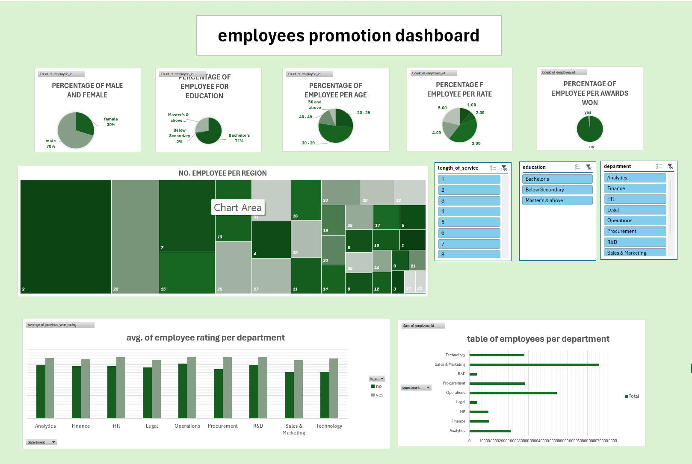

# 📊 Employee Promotion Dashboard

An interactive Excel dashboard analyzing promotion patterns across **54,808 employees**, built as part of a data analysis project at Tuwaiq Academy.

## Overview
This project explores which factors are associated with employee promotions, including department, region, education, gender, age, length of service, previous year rating, and awards won.

## Workflow
1. **Raw data:** imported the original employee dataset
2. **Data cleaning:** standardized values (e.g. gender and yes/no fields), converted region codes to numbers, and created age groups using formulas
3. **Analysis:** built pivot tables summarizing employees by each factor
4. **Dashboard:** combined the results into one interactive view

## Dashboard Features
- Breakdown of employees by gender, education, age group, rating, and awards won
- Treemap of employees per region
- Average previous year rating per department, split by promotion status
- Employees per department
- Interactive slicers to filter by length of service, education, and department

## Tools
- Microsoft Excel (data cleaning, formulas, pivot tables, pivot charts, slicers)

## Files
- `Employee_Promotion_Dashboard.xlsx` — the full workbook (raw data, clean data, pivot tables, and dashboard)
